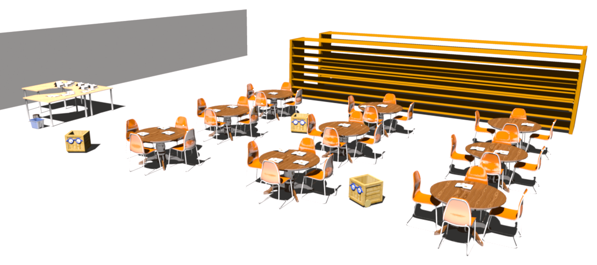

The Ranger librarian
====================

This is a collection of two ROS packages containing different nodes/launchers required to use Ranger robot as a library assistant.


For more information, see the readme files in the `gui` and `helpers` directories.

# Mapping

Start the robot and mappign as described in [helpers usage](https://github.com/chili-epfl/ranger_librarian/tree/master/helpers#usage) section.
Make sure that afterwards in the directory
```
$roscd ranger_librarian_helpers/maps
```
you have the waypoints, map, rtabmap databasie files with the same timestamp, e.g.
```
map_1435156541714421033.pgm
map_1435156541714421033.yaml
rtabmap_1435156541714421033.db
waypoints_1435156541714421033
```
# Navigation

For the robot navigation, start the launch file with `time_stamp` argument, e.g.
```
roslaunch ranger_librarian_helpers ranger_nav.launch time_stamp:=1435156541714421033
```
Then rtabmap should perform odometry correction using 3D created map.

# Control and GUI

Make sure you have an usb camera for label reading started with
```
rosrun usb_cam usb_cam_node _video_device:="/dev/videoX"
```
where `videoX` is your video device, e.g. `video0, video1, etc.`.

Then start the control with GUI:
```
rosrun ranger_librarian_gui ranger_librarian_gui
```
