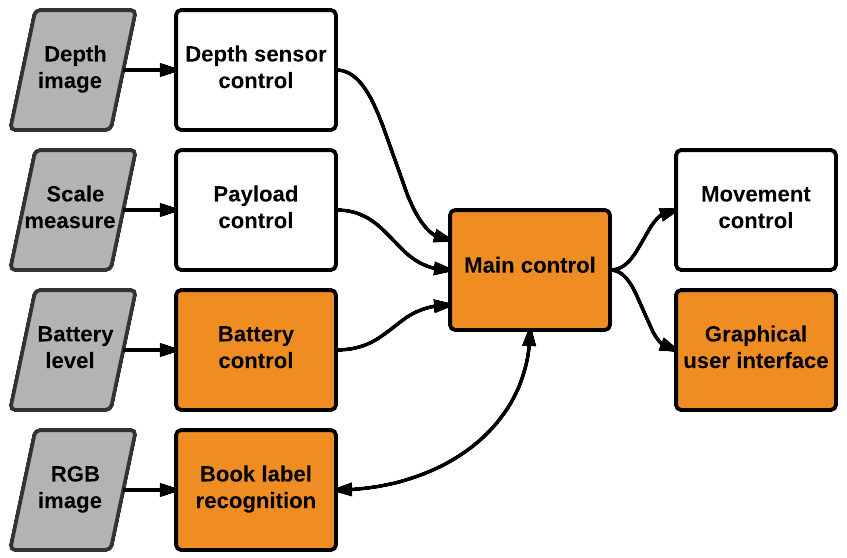
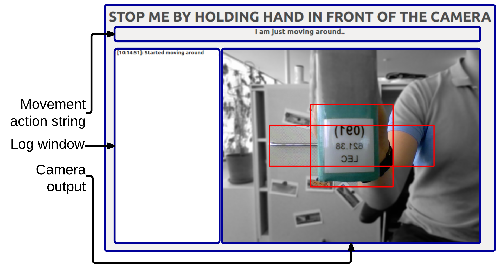

ranger_librarian_gui
------------------------
This ROS package contains nodes/launchers helping to run ranger as library assistant.
Particularly from the modular architecture, the main controller is implemented with integrated book label reading and simple graphical user interface. As well, batterry level, obtained from `ranger_ros` node, is checked to control the navigator.
<p align=center>

</p>


#Usage

Make sure you have an usb camera for label reading started with
```
rosrun usb_cam usb_cam_node _video_device:="/dev/videoX"
```
from [`usb_cam` ROS package](http://wiki.ros.org/usb_cam),
where videoX is your video device, e.g. `video0`, `video1`, etc..

Then start the control with GUI:
```
rosrun ranger_librarian_gui ranger_librarian_gui
```

Example of Graphical User Interface
------------------------

<p align=center>

</p>


